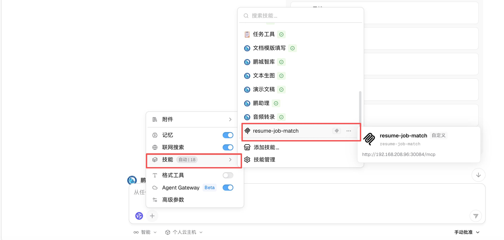
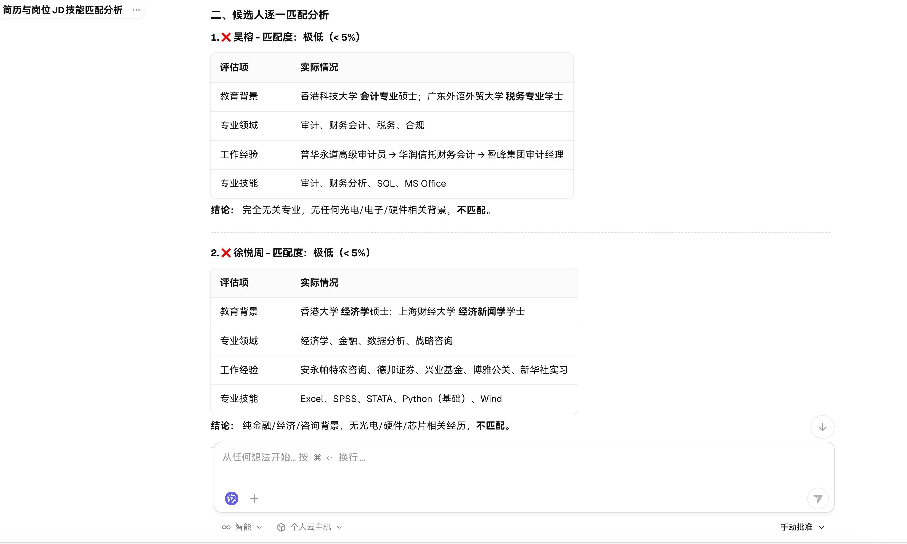

# 鹏智“简历岗位匹配”使用教程

适用场景：在鹏智AI平台调用简历岗位匹配Skill，上传岗位JD与候选人简历，自动完成候选人综合评估、横向对比，输出结构化招聘分析报告。
技能支持单份候选人评估，也支持批量简历同时比对分析。报告生成通常需要数分钟；简历数量较多、服务繁忙时耗时略有增加。

## 一、使用前准备
请确认您已满足下面的使用要求：

| 项目 | 说明 |
| ---- | ---- |
| 网络环境 | 办公网、VPN 或可访问内网服务的网络 |
| 鹏智 AI 平台地址 | [https://aiat.pcl.ac.cn](https://aiat.pcl.ac.cn) |
| 统一认证账号 | 鹏城实验室统一认证账号 |
| Skill 名称 | 简历岗位匹配（resume-job-match） |
| 支持匹配模式 | 综合匹配打分、优势亮点提取、风险短板识别、候选人横向对比、录用优先级排序 |
| 输入方式 | 上传岗位JD（docx）+候选人简历（pdf），支持批量简历同时评估 |
| 生成耗时 | 单批次5份简历评估约3~5分钟 |
| 输出格式 | 候选人匹配得分表 + 优缺点分析 + 岗位适配结论汇总报告 |

> 登录鹏智 AI 平台的详细步骤请参考《鹏智使用教程》，本文不再重复。

## 二. 开始简历评价
1. **启用插件**
开启新会话，在会话中点击输入框下方的“+”，选择“技能”，找到 简历岗位匹配 并固定启用。

2. **文件上传**
   - 岗位JD文件：支持docx格式，完整包含岗位名称、专业要求、技能条件、工作经验硬性门槛；
   - 候选人简历：支持PDF格式，单份/批量多份简历同时上传；
> 建议：JD单独一个文档。

3. 输入描述
对话内直接发送指令：调用 resume-job-match 技能开展简历岗位匹配评估

4. 生成结果
技能运行完成后，自动输出标准化《岗位匹配分析报告》，报告固定包含4大模块：
### 模块1：岗位核心要求拆解
提取JD内容，拆分岗位硬性门槛：专业背景、必备技能、项目/工作经验，区分工程师/研究岗不同要求（如存在），以表格结构化展示。

### 模块2：候选人逐一匹配分析
每位候选人独立小节，包含表格评估：
- 教育背景
- 专业领域
- 工作/项目经验
- 掌握专业技能
最后输出**匹配度区间 + 简短结论**（匹配/不匹配）。

### 模块3：综合汇总表格
汇总全部候选人清单：候选人姓名、匹配度区间、推荐程度（推荐/不推荐），一目了然批量筛选。

### 模块4：全局总结与招聘建议
1. 整体筛选结论（多少候选人满足基本门槛）；
2. 不匹配核心原因归纳（专业不符、技能缺失、行业经验不相关等）；

## 三、快速使用流程总结
1. 使用实验室统一账号登录鹏智AI平台，新建空白对话会话；
2. 点击输入框下方「+」→【技能】，找到「简历岗位匹配（resume-job-match）」并启用；
3. 上传1份岗位JD（docx）+ 候选人简历（PDF，支持批量）；
4. 在对话框发送指令：调用resume-job-match技能开展简历岗位匹配评估；
5. 等待任务执行完成，获取标准化《岗位匹配分析报告》；
6. 人工复核报告内容，用于招聘参考。

## 四、安全说明
- 请勿上传涉密人员信息、未公开项目资料、内部敏感招聘信息；
- 所有数据处理在内网集群完成，业务文件不会转发至外部公网服务；
- AI生成的匹配报告仅作为招聘辅助参考，不能直接作为录用唯一依据，全部结论需要人工核验；
- 简历、岗位需求涉及人员隐私，请妥善保存文件，严禁通过公网向外转发、扩散。
