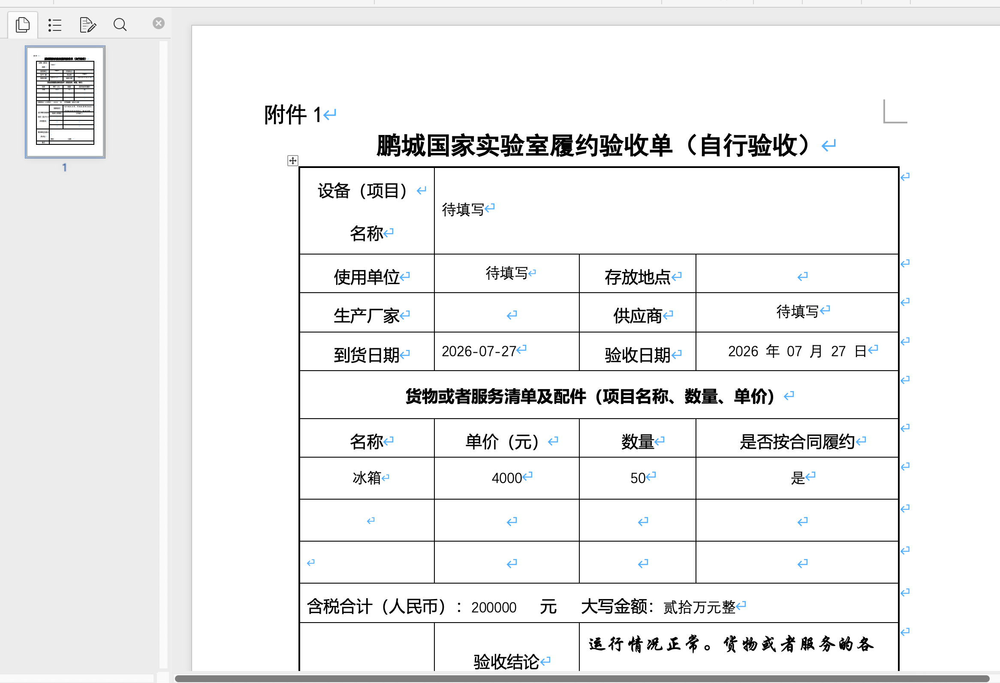

# 文档模板填写 使用说明
**鹏智 “文档模板填写” 使用教程**
> 适用场景：在鹏智 AI 平台调用文档模板填写 Skill，通过自然语言自动匹配业务 Word 模板，提取信息填充内容，直接生成标准化 Word 文档。
> 技能支持直接指定模板名称生成文档；也支持上传业务资料辅助提取字段。文档渲染通常需要数十秒；模板数量多、字段复杂或服务繁忙时耗时略有增加。

## 一、使用前准备
请确认您已满足下面的使用要求：

| 项目 | 说明 |
| ---- | ---- |
| 网络环境 | 办公网、VPN 或可访问内网服务的网络 |
| 鹏智 AI 平台地址 | [https://aiat.pcl.ac.cn](https://aiat.pcl.ac.cn) |
| 统一认证账号 | 鹏城实验室统一认证账号 |
| Skill 名称 | 文档模版填写（word-fill） |
| 支持模式 | 自动模板匹配、指定模板生成、业务字段自动提取 |
| 输入方式 | 自然语言描述业务信息，可选上传参考材料；支持指定模板名称 |
| 生成耗时 | 单份文档生成约30秒~2分钟 |
| 输出格式 | 填充完成的Word文档，附带内网直链下载地址 |

> 登录鹏智 AI 平台的详细步骤请参考《鹏智使用教程》，本文不再重复。

## 二. 启用插件
开启新会话，在会话中点击输入框下方的“+”，选择“技能”，找到 文档模版填写 并固定启用。

## 三. 基础交互
### 查询全部可用模板与填写字段
**示例：**
Agent返回模板列表与场景说明。

当前内置可用模板清单
|序号|模板名称|适用业务场景|
|----|--------|------------|
|1|PCNL网上竞价项目需求书（货物类）|采购GPU服务器、射频硬件、仪器等实体硬件货物，网上竞价立项，支持两条货物明细|
|2|PCNL网上竞价项目需求书（服务类）|算法外包、数据标注、维保、测试认证等非实体服务采购竞价立项|
|3|网上竞价项目供应商履约评价表|项目验收完成后，对供应商交付质量、服务、时效进行打分评价归档|
|4|【采购】(5w以下)04PCNL履约验收单（自行验收）|5万元以内小额采购，到货后内部三人自行验收，完成采购履约归档|

> 模板清单支持运维持续新增、迭代更新，下方清单为当前生效版本，后续更新模板后清单内容同步扩充。

Agent返回模板填写字段列表。

### 发起文档填写请求
示例：

> 系统自动识别匹配模板：【采购】(5w以下)04PCNL履约验收单（自行验收）

> ⚠️ 注意：建议手动指定模板名称强制生成，例如该模板原始设计用于5万以内采购；金额超5w时，agent未找到更匹配模版可能会强行填写不符合模版。

> ⚠️ 注意：涉密或未知信息的必填字段会先用"待填写"填入，可以下载后自行手动填写。

#### 精确指定模板名称 + 填写参数（推荐）
示例：使用【采购】(5w 以下) 04PCNL 履约验收单（自行验收）模板，采购物品：冰箱 50 台，单价 4000 元，总金额 200000 元，验收日期 2026 年 7 月 27 日

### 下载链接
Agent完成后，页面展示文档信息：文件名、采购明细、金额、验收日期；同时提供**Word文档下载链接**。
链接特性：
- 默认有效期：48小时

## 二、快速使用流程总结
1. 登录鹏智AI平台，加载【文档模版填写（word-fill）】Skill；
2. 输入业务信息，支持指定模板名称，可上传补充参考材料；
3. 等待系统自动生成填充完成的Word文档；
4. 通过链接下载文档，人工校验内容后使用。

## 五.安全说明
- 不要上传涉密文档、敏感业务资料、人员隐私信息、内部未公开方案等涉密内容。
- 生成的文档文件保存在内网集群，不会上传至外部公网服务。
- AI生成内容仅作为业务辅助工具，输出文档务必人工复核校验，不可直接对外正式提交。
- 如材料包含未公开内部业务成果，请妥善保管生成文件，禁止通过公网对外分享传播。
