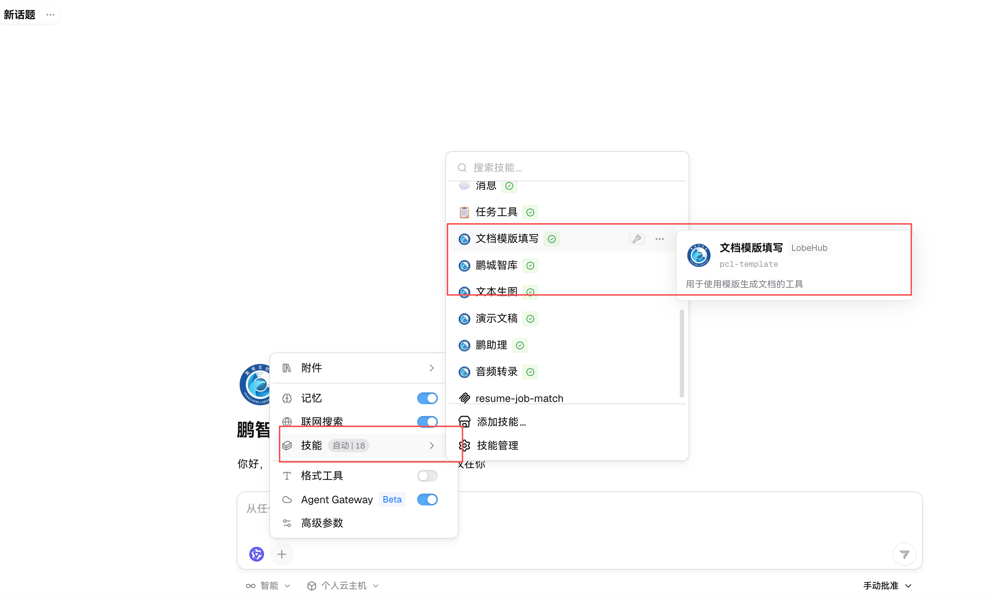
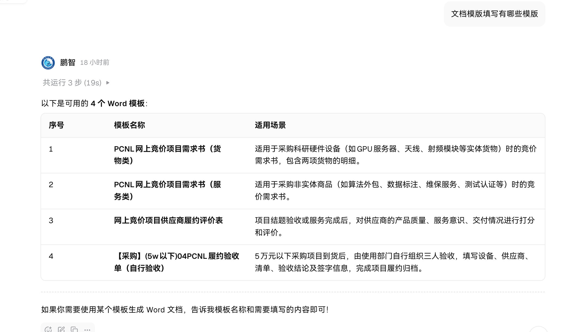
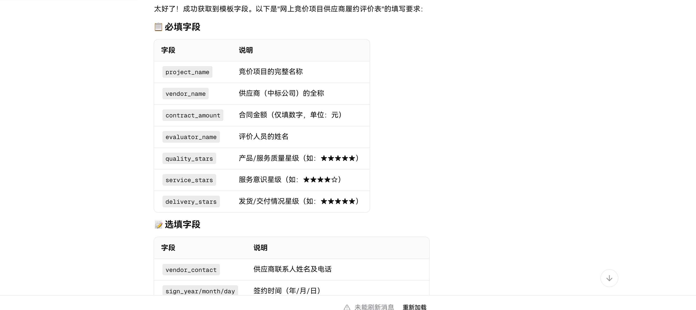
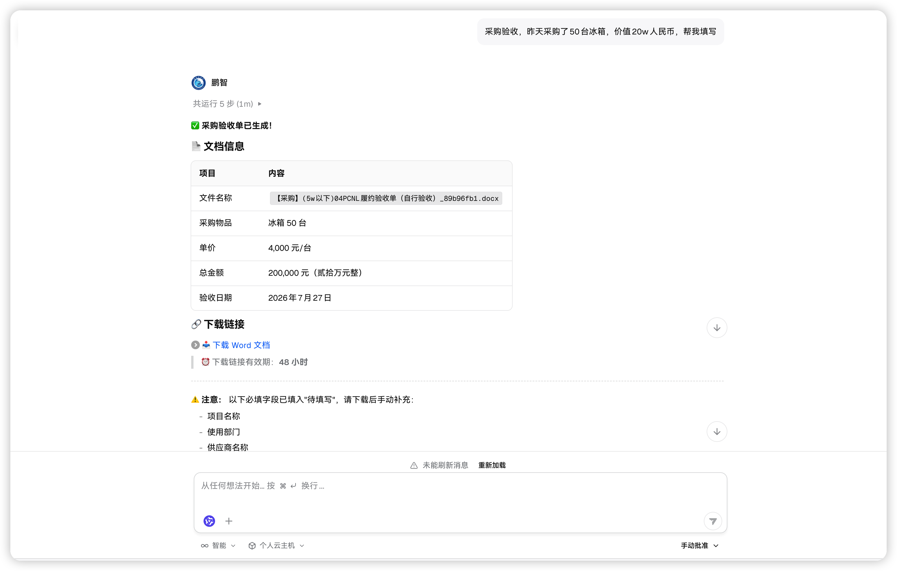

# Word文档模板填写技能 使用说明书
## 1. 功能概述
**文档模版填写**是基于MCP协议开发的Word自动生成技能，内置PCL采购相关标准化Word模板；用户通过自然语言描述需求，Agent自动匹配模板、提取业务字段、渲染生成Word文档，并返回外网直链供下载。
服务部署于内部集群，支持多套标准文档一键生成。

## 2. 当前内置可用模板清单

|序号|模板名称|适用业务场景|
|----|--------|------------|
|1|PCNL网上竞价项目需求书（货物类）|采购GPU服务器、射频硬件、仪器等实体硬件货物，网上竞价立项，支持两条货物明细|
|2|PCNL网上竞价项目需求书（服务类）|算法外包、数据标注、维保、测试认证等非实体服务采购竞价立项|
|3|网上竞价项目供应商履约评价表|项目验收完成后，对供应商交付质量、服务、时效进行打分评价归档|
|4|【采购】(5w以下)04PCNL履约验收单（自行验收）|5万元以内小额采购，到货后内部三人自行验收，完成采购履约归档|

> 模板清单支持运维持续新增、迭代更新，下方清单为当前生效版本，后续更新模板后清单内容同步扩充。

## 3. 基础交互
### 查询全部可用模板与填写字段
**示例：**
Agent返回模板列表与场景说明。

Agent返回模板填写字段列表。

### 发起文档填写请求
示例：

> 系统自动识别匹配模板：【采购】(5w以下)04PCNL履约验收单（自行验收）

> ⚠️ 注意：建议手动指定模板名称强制生成，例如该模板原始设计用于5万以内采购；金额超5w时，agent未找到更匹配模版可能会强行填写不符合模版。

> ⚠️ 注意：涉密或未知信息的必填字段会先用"待填写"填入，可以下载后自行手动填写。

#### 精确指定模板名称 + 填写参数（推荐）
示例：使用【采购】(5w 以下) 04PCNL 履约验收单（自行验收）模板，采购物品：冰箱 50 台，单价 4000 元，总金额 200000 元，验收日期 2026 年 7 月 27 日

### 下载链接
Agent完成后，页面展示文档信息：文件名、采购明细、金额、验收日期；同时提供**Word文档下载链接**。
链接特性：
- 默认有效期：48小时
